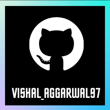

<h1 align="center">Hi 👋, I'm vishal aggarwal</h1>
<h3 align="center">A passionate frontend and backend developer from India</h3>

<button><a href="https://www.instagram.com/vishal_aggarwal97/">Follow me on instagram</a></button>

  

- 🔭 I’m currently working on **My personal project which will help all in further coming days**

- 🌱 I’m currently learning ** cpp ,java ,python, data structures ,software development**

- 🐱‍💻 I'm now want to be a ethical hacker but not a black hat hacker.

- 👨‍💻 All of my projects are available at [https://github.com/VAggarwal97](https://github.com/VAggarwal97)

- 📝 I regularly write articles on [Code](Code)

- 💬 Ask me about **web development, frontend etc.**

- 📫 How to reach me **vishalaggarwal8978@gmail.com**

- 📄 Know about my experiences [Working on my resume to make it my perfect](Working on my resume to make it my perfect)

- ⚡ Fun fact **I always think that money can buy every thing u want**

<h3 align="left">Connect with me:</h3>

<h3 align="left">Languages and Tools:</h3>

                

&nbsp;

<h2>Support me by following me on instagram</h1>
<button><a herf="https://www.instagram.com/vishal_aggarwal97/">INSTAGRAM LINK IS HERE</a></button>

    </img>
    <h5>VISHAL_AGGARWAL97</h5>

# GitHub Profile Achievements 🏆

A collection listing all Achievements available on the GitHub profile.

Following the launch of the first Mars Helicopter, [Ingenuity](https://en.wikipedia.org/wiki/Ingenuity_(helicopter)), GitHub [announced](https://github.blog/2021-04-19-open-source-goes-to-mars/) the new Achievements section:

> We are also using this opportunity to introduce a new Achievements section to the GitHub profile. Right now, Achievements include the Mars 2020 Helicopter Mission badge, the [Arctic Code Vault](https://archiveprogram.github.com/arctic-vault/) badge, and a badge for sponsoring open source work via [GitHub Sponsors](https://github.com/sponsors).

This repository attempts to list them all.

**2022-06-09:** GitHub [announced more Achievements](https://github.blog/2022-06-09-introducing-achievements-recognizing-the-many-stages-of-a-developers-coding-journey/), but without specific criteria. If you see something not listed here or is incorrect, please open an issue :)

Don't like the Achievements? [Here](https://docs.github.com/account-and-profile/setting-up-and-managing-your-github-profile/managing-contribution-settings-on-your-profile/showing-your-private-contributions-and-achievements-on-your-profile#changing-the-visibility-of-achievements) is how to disable them. [Direct link to the setting for your convenience](https://github.com/settings/profile#profile-settings-heading).

## Achievements

| Title | Badge | Earnable? | Earned by |
| --- | --- | --- | --- |
Pair Extraordinaire |  | ✔️ | [Coauthored](https://docs.github.com/pull-requests/committing-changes-to-your-project/creating-and-editing-commits/creating-a-commit-with-multiple-authors) in a merged pull request
Quickdraw |  | ✔️ | Closed an issue or a pull request within 5 min of opening
Starstruck |  | ✔️ | Created a repository that has 16 stars
||| <!-- this empty row is intentional to separate -->
Galaxy Brain |  | ✔️ | 2 accepted answers
Pull Shark |  | ✔️ | 2 pull requests merged
YOLO |  | ✔️ | Merged a pull request without code review
||| <!-- this empty row is intentional to separate -->
Arctic Code Vault Contributor |  | ❌ | Contributed code to repositories in the [2020 GitHub Archive Program](https://archiveprogram.github.com/)
Public Sponsor |  | ✔️ | Sponsoring open source work via [GitHub Sponsors](https://github.com/sponsors)
Mars 2020 Contributor |  | ❌ | Contributed code to repositories used in the [Mars 2020 Helicopter Mission](https://github.com/readme/nasa-ingenuity-helicopter)
